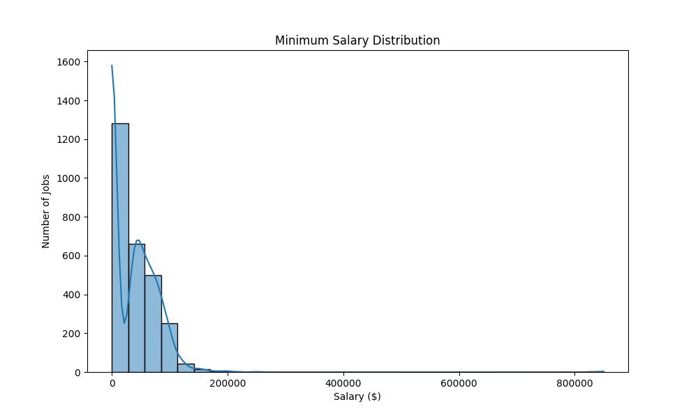
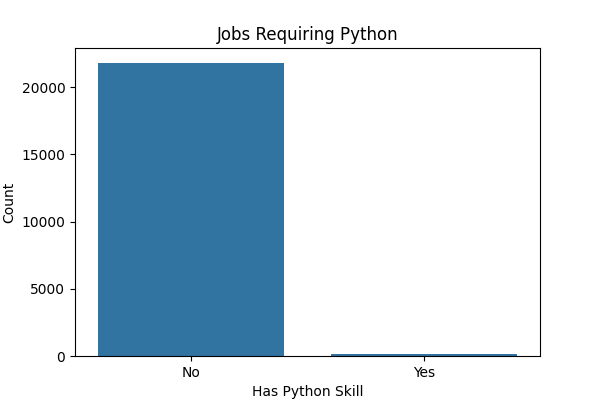

# Job Trends Data Pipeline

This project analyzes job listing data to uncover insights about skills, salaries, and remote work trends. It features a Python data pipeline that cleans raw job data and produces visualizations to help understand the job market better.

## Project Overview

- Load raw job listings data from CSV
- Clean and normalize salary data
- Identify remote job postings
- Extract key skill indicators (Python, SQL, Excel)
- Bucket salaries into meaningful ranges
- Generate visualizations for salary distribution and skill demand

## Features Implemented So Far

- Data cleaning with `transform.py`
- Skill extraction (Python, SQL, Excel)
- Seniority level detection from job titles
- Remote job parsing and flagging
- Interactive dashboard with Streamlit for exploration and visualization

## How to Run

1. Clone the repository  
2. Create and activate a virtual environment:
    ```bash
    python3 -m venv env
    source env/bin/activate
    ```
3. Install dependencies:
    ```bash
    pip install -r requirements.txt
    ```
4. Add your raw job listings CSV as `data/rawjobs.csv`  
5. Run the cleaning script:
    ```bash
    python scripts/transform.py
    ```
6. Run the interactive dashboard:
    ```bash
    streamlit run app.py
    ```

**Note:** The file `explore.py` has been renamed to `app.py` to support the Streamlit dashboard.

## Sample Visualizations

### 📊 Salary Distribution


### 💻 Python Skill Presence



## Skills & Tools

- Python  
- Pandas  
- Matplotlib  
- Seaborn  
- Data Cleaning & Visualization  

---

Feel free to contribute or raise issues for improvements!

---

Thank you!!